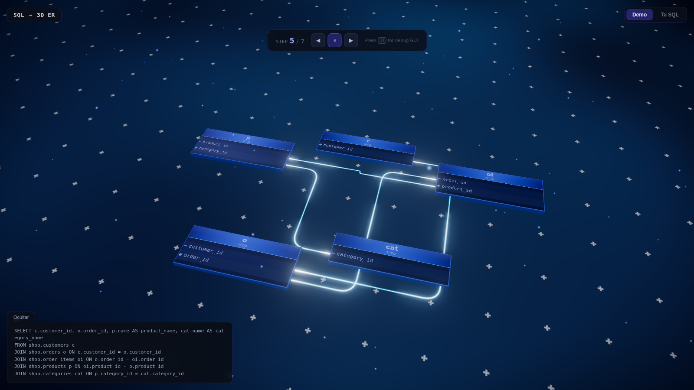
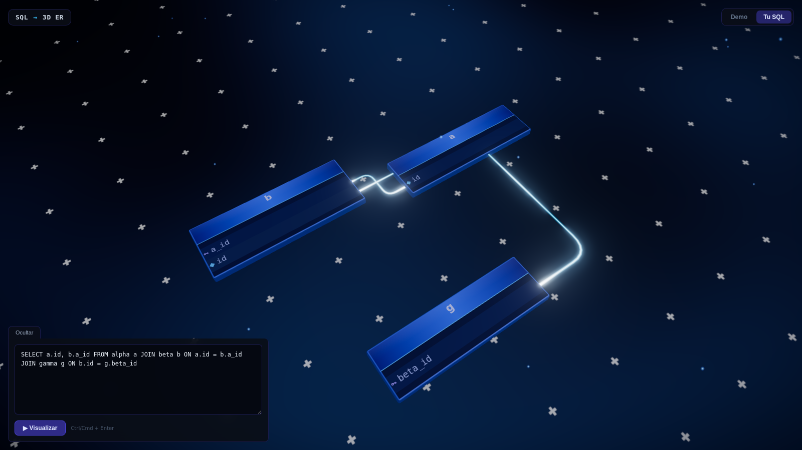

# SQL → 3D ER Diagram Visualizer

Type a SQL query and watch it turn into an animated, orthogonally-routed 3D
entity-relationship diagram — tables sink into the ground, resolve their
joins, and rise back up connected by glowing, particle-lit cables.

**Live demo →** https://sql-prototype.vercel.app



## What it does

- **Write your own SQL** and get an instant 3D diagram of the tables and the
  join relationships between them (foreign keys, join type, aliases).
- **Watch the guided demo**: a sample e-commerce query is built up step by
  step — from a single table to a query with six joins and a subquery — so
  you can see how the diagram evolves as a query grows.
- Hover a table to highlight it and its relationships; orbit the camera
  around the scene.

<p align="center">
  
</p>

## How it works

```
SQL string
   │
   ▼
┌─────────────────────────┐        ┌───────────────────────────────┐
│ SQL parser (pick one)    │        │  node-sql-parser (in-browser)  │
│                          │──────► │  sqlglot (Python microservice) │
└─────────────────────────┘        └───────────────────────────────┘
   │  AST → { nodes: tables, links: joins }
   ▼
┌─────────────────────────┐
│  d3-force-3d layout      │  positions tables in 3D space
└─────────────────────────┘
   │
   ▼
┌─────────────────────────┐
│  Three.js renderer       │  table meshes, orthogonally-routed cable
│  + custom GLSL shaders   │  geometry, particle flow, bloom/vignette
└─────────────────────────┘  post-processing, orbit camera
```

Two SQL-to-graph engines are wired up on purpose, as a resilience/comparison
exercise:

- **`node-sql-parser`** runs entirely in the browser (default, no backend
  required, works instantly on Vercel).
- **`sqlglot`** runs as a Python service — locally as a FastAPI server, in
  production as a Vercel serverless function (`/api/parse`) — and is more
  robust on complex dialect-specific SQL. If it can't reach the backend or
  returns nothing, the app falls back to `node-sql-parser` automatically.

You can switch between them from the debug panel (press `H`).

## Tech stack

| Layer      | Tech                                                             |
| ---------- | ----------------------------------------------------------------- |
| Frontend   | Angular 20 (standalone components, signals)                       |
| 3D / WebGL | Three.js, `three-forcegraph`, `d3-force-3d`, custom GLSL shaders   |
| SQL parsing| `node-sql-parser` (client), `sqlglot` (Python backend)             |
| Backend    | FastAPI (local dev) / Vercel Python serverless function (prod)     |
| Deployment | Vercel                                                             |

## Running locally

### Frontend

```bash
npm install
npm start          # http://localhost:4200
```

### SQL backend (optional — only needed to use the `sqlglot` engine locally)

```bash
cd backend
pip install -r requirements.txt
python main.py      # http://localhost:8000
```

With both running, open `http://localhost:4200`, press `H` to open the debug
panel, and switch the **Parser → Engine** dropdown to `sqlglot`.

### Build

```bash
npm run build       # outputs to dist/sql-prototype/browser
```

## Deployment

The app is deployed on [Vercel](https://vercel.com). `vercel.json` builds the
Angular app and exposes `api/parse.py` as a serverless function for the
`sqlglot` engine, so no separate backend hosting is needed in production.

## Project structure

```
src/app/
├── core/services/           # SQL parsing services + query simulator
├── features/er-diagram/     # The 3D visualization feature
│   ├── systems/              # Scene, camera, particles, transitions, GUI...
│   └── shaders/               # Custom GLSL (cable, ground, vignette)
└── shared/models/            # Shared graph (nodes/links) data model

backend/main.py               # FastAPI sqlglot server (local dev)
api/parse.py                  # Vercel serverless function (production)
```

## License

MIT — see [LICENSE](LICENSE).
